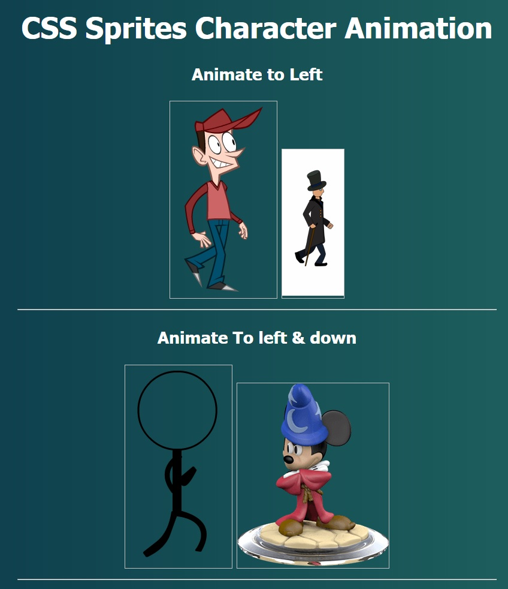

# CSS-Sprites-Character-Animation

here's the demo:-

[Demo Website](http://ahmed-badawy.com/tests/css-sprites/CSS-Sprites-Character-Animation/index.html)

## Documentation: 

#### Animating One Row:
    <!--must define the width & height of each item of image-->
    
 

    //then in the script:-
	animate_one_row({
		id: 'img1', //the id of the img elm
		x: 185,     //the width for each item in the row
		x_slides: 8,    //the number of items in the row
		timer: 100,     //speed of animation
		img: './sprites/capguy-walk.png'   //the image link
	});

#### notice that x & y in the code are the same width & height of any item in the image. 

---

---

#### Animating Multiple Rows & columns:
    <!--must define the width & height of each item of image-->
    
 
    //then in the script:-
	animate_full_sprite({
		id: 'img1',   //the id of the img elm
		x: 180,       //the width for each item in the row
		y: 340,       //the height for each item in the row
		x_slides: 9,  //number of img items in a row
		y_slides: 8,  //number of img items in one column 
		timer: 100,   //speed of animation
		img: './sprites/player-running.png'    //the image link
	});

---

---

#### Automatic Animating Multiple Rows & columns: 
this will calculate  width & height (x & y) automatically depending on the size of the image.
      
    <!--here you can omit the width & height properties-->    
    
 
    //then in the script:-
	auto_animate_full_sprite({
		id: 'img1',     //id of the img elm
		x_slides: 16,    // number of img items in a row
		y_slides: 16,    //number of img items in a column 
		timer: 80,      //speed of animation
		img: './sprites/actionstashhd.png'    //img link
	});

	